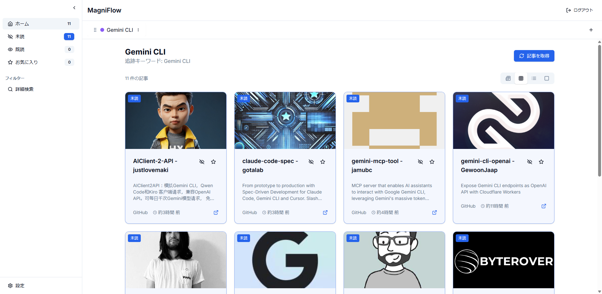

# MagniFlow - 情報収集・キュレーションツール

MagniFlowは、複数の情報源から自動的に技術記事やニュースを収集し、整理する情報収集ツールです。

## 特徴

- 🆓 **完全無料** - APIキー不要で基本機能を利用可能
- 🚀 **Premium検索対応** - Google/YouTube APIでより高品質な検索結果
- 📰 **複数の情報源** - Qiita、Zenn、はてな、GitHub等から自動収集
- 🔍 **高度な検索** - AND/OR検索、除外キーワード、検索ソース選択
- 📁 **タブ管理** - トピック別に情報を整理、ドラッグ&ドロップで並び替え
- 💾 **データ永続化** - ローカルファイルシステムにデータを保存
- 🎨 **カスタマイズ可能** - タブの色やアイコン、表示レイアウトを自由に設定
- 🔧 **高度な設定** - カスタムRSSフィード、ドメインフィルター、更新スケジュール、API別の記事数制限

## 情報源

- **Qiita**: 技術記事・プログラミング情報
- **Zenn**: エンジニア向け情報共有プラットフォーム
- **はてなブックマーク**: IT・一般ニュース（ITと一般の両方）
- **ITmedia**: IT技術ニュース・AI関連記事
- **Publickey**: エンタープライズIT情報
- **GitHub**: オープンソースプロジェクト（60回/時の制限）
- **DuckDuckGo**: 一般検索（Instant Answer API）
- **カスタムRSSフィード**: 任意のRSSフィードを追加可能

### Premium検索ソース（APIキー設定で利用可能）
- **Google Custom Search**: ウェブ全体の高品質な検索結果（100クエリ/日 無料）
- **YouTube Data API**: 動画コンテンツの検索（10,000ユニット/日 無料）

### 機能の特徴
- **ハイブリッド検索**: 無料APIとPremium APIを組み合わせて最適な結果を取得
- **動画対応**: YouTube APIによる動画コンテンツの検索・表示
- **記事数制限**: 各APIソースで取得する記事数を個別に設定可能（1〜100件）
- **言語対応**: 日本語・英語のコンテンツを中心に多言語対応

## セットアップ

### 必要要件

- Node.js 18.18以上
- npm または yarn

### インストール

```bash
# リポジトリをクローン
git clone https://github.com/cruzyjapan/MagniFlow.git
cd MagniFlow

# 依存関係をインストール
npm install

# 環境変数ファイルを作成
cp .env.local.example .env.local

# 開発サーバーを起動
npm run dev
```

### 環境変数の設定

`.env.local`ファイルを編集：

```env
# 必須設定
NEXTAUTH_URL="http://localhost:7000"
NEXTAUTH_SECRET="your-secret-key-here"  # openssl rand -base64 32 で生成

# Premium検索API（オプション - より良い検索結果のため）
# Google Custom Search API (100クエリ/日 無料)
# https://developers.google.com/custom-search/v1/overview
GOOGLE_API_KEY=""
GOOGLE_SEARCH_ENGINE_ID=""

# YouTube Data API (Google APIキーと同じ)
YOUTUBE_API_KEY=""

# その他の設定
PORT="7000"                 # サーバーポート（デフォルト）
```

## スクリーンショット

### ダッシュボード
<div align="center">
<table>
<tr>
<td align="center">

<br>
</td>
</tr>
</table>
</div>
*タブごとに記事を整理し、複数のレイアウトで表示*

## 使い方

1. **アクセス**: `http://localhost:7000`にアクセス

2. **ログイン**: 
   - メールアドレスを入力（任意のメールアドレスでOK）
   - デモ用の簡易認証のため、パスワードは不要

3. **タブ作成**: 
   - 「＋」ボタンをクリック
   - タブ名とキーワードを入力（例：「React」「Next.js」「TypeScript」）
   - 色とアイコンを選択

4. **記事取得**:
   - 「記事を取得」ボタンをクリック
   - 自動的に複数のソースから記事を収集

5. **フィルタリング**:
   - サイドバーから既読/未読/お気に入りでフィルター
   - 詳細検索で記事内検索

6. **高度な設定**（タブ編集 > 高度な設定）:
   - **検索設定**: AND/OR検索、除外キーワード
   - **Premium検索API**: Google/YouTube APIの有効/無効切り替え
   - **ソース**: 検索ソースの個別ON/OFF、記事数制限（1〜100件）、カスタムRSSフィード追加
   - **フィルター**: 言語、期間（24時間〜1ヶ月）、許可/除外ドメイン
   - **スケジュール**: 自動更新間隔（15分〜24時間）

7. **表示レイアウト**: ヒーロー、グリッド、リスト、コンパクトから選択

## データ構造

データは`.data/`ディレクトリに保存されます：

```
.data/
├── tabs.json     # タブ設定
└── articles.json # 記事データ
```

## 開発

```bash
# 開発サーバー
npm run dev

# ビルド
npm run build

# 本番サーバー
npm run start

# リント
npm run lint

# 型チェック
npm run type-check
```

## トラブルシューティング

### ポート7000が使用中の場合
```bash
# 別のポートで起動
PORT=8000 npm run dev
```

### データをリセットする場合
```bash
rm -rf .data/
```

### 認証エラーが発生する場合
1. ブラウザのCookieをクリア
2. `NEXTAUTH_SECRET`を再生成
3. サーバーを再起動

## 技術スタック

- **フレームワーク**: Next.js 14 (App Router)
- **認証**: NextAuth.js v4（デモ用簡易認証）
- **UI**: Tailwind CSS, shadcn/ui
- **状態管理**: Zustand (永続化対応)
- **データ取得**: React Query (TanStack Query)
- **RSSパーサー**: rss-parser
- **ドラッグ&ドロップ**: @dnd-kit
- **データストレージ**: ファイルシステム (.data/)

## ライセンス

MIT License

## サポート

問題が発生した場合は、[GitHubのIssue](https://github.com/cruzyjapan/MagniFlow/issues)を作成してください。

## リポジトリ

[https://github.com/cruzyjapan/MagniFlow](https://github.com/cruzyjapan/MagniFlow)